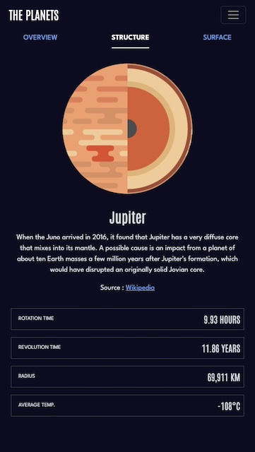
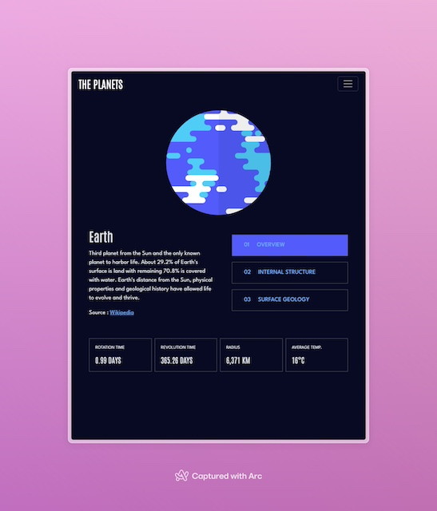

# Frontend Mentor - Planets fact site solution

This is a solution to the [Planets fact site challenge on Frontend Mentor](https://www.frontendmentor.io/challenges/planets-fact-site-gazqN8w_f). Frontend Mentor challenges help you improve your coding skills by building realistic projects. 

## Table of contents

- [Overview](#overview)
  - [The challenge](#the-challenge)
  - [Screenshot](#screenshot)
  - [Links](#links)
- [My process](#my-process)
  - [Built with](#built-with)
  - [What I learned](#what-i-learned)
  - [Useful resources](#useful-resources)
- [Author](#author)
- [Acknowledgments](#acknowledgments)

**Note: Delete this note and update the table of contents based on what sections you keep.**

## Overview

### The challenge

Users should be able to:

- View the optimal layout for the app depending on their device's screen size
- See hover states for all interactive elements on the page
- View each planet page and toggle between "Overview", "Internal Structure", and "Surface Geology"

### Screenshot






### Links

- Solution URL: [https://github.com/tomwinskell/planets](https://github.com/tomwinskell/planets)
- Live Site URL: [https://tomwinskell.github.io/planets](https://tomwinskell.github.io/planets)

## My process

### Key Features and Implementation Details 

1. **Bootstrap Integration**:  
   - Navigation components were used directly from Bootstrap.  
   - Most styling relies on Bootstrap classes for simplicity and consistency.  

2. **Responsive Design**:  
   - The HTML and initial Bootstrap classes were designed for mobile-first layouts.  
   - Additional classes were added to enhance layouts for larger screens.  

3. **Custom Styling**:  
   - A minimal amount of custom CSS in `style.css` is used for styling outside Bootstrap's scope, such as colors and font styles.  

4. **Template Rendering**:  
   - Mustache templates are used for rendering dynamic content.  

5. **JavaScript Functionality**:  
   - The Fetch API is used to load data from a locally stored JSON file.  
   - Based on user-selected resources, this data is dynamically injected into templates using Mustache.js.  
   - The resulting HTML is then inserted into `index.html`.  

6. **Optimized Performance**:  
   - All data is loaded from the server when `index.html` is initially accessed.  
   - After this, everything is rendered client-side, ensuring quick and seamless website transitions.  

### Built with

- Semantic HTML5 markup
- CSS custom properties
- Flexbox
- Bootstrap 5.3
- Mobile-first workflow
- JavaScript
- [Mustache.js](https://mustache.github.io/) - for templating

## What I learned

### Using Mustache.js for Templating  

For this project, I utilized **Mustache.js** to handle HTML templating. The library was included via a CDN link in `index.html`. JavaScript is then used to dynamically set the `innerHTML` of a `<div>` element with content rendered by Mustache.js.  

#### Rendering Data with Mustache.js  
The following snippet demonstrates how data is rendered into a Mustache template and subsequently inserted into the DOM:  

```javascript
mainText.innerHTML = Mustache.render(await renderTemplate('main_text'), dataObject);
```  

Here’s an example of the corresponding Mustache template:  

```html
<h1 class="display-1 font-antonio text-uppercase mb-3" id="js__name">
  {{name}}
</h1>
<div class="font-spartan fs-6">
  {{content}}
  <div class="mt-3">
    Source: <a href="{{{source}}}">Wikipedia</a>
  </div>
</div>
```  

### Fetching Templates and Data  
The project leverages the Fetch API to load both JSON data and Mustache template files. Below is a function that retrieves a Mustache template file as a string:  

```javascript
async function renderTemplate(templateName) {
  const response = await fetch(`./${templateName}.mustache`);
  const template = await response.text();
  return template;
}
```  

By combining these elements, the application dynamically renders content into the DOM, creating a responsive and modular design workflow.

### Useful resources

- [Bootstrap](https://getbootstrap.com/) - Official documentation for the popular CSS framework.
- [Mustache.js](https://mustache.github.io/) - Official site for the Mustache templating library.
- [MDN: Fetch API](https://developer.mozilla.org/en-US/docs/Web/API/Fetch_API) - Comprehensive guide to the Fetch API on MDN.

## Author

- Frontend Mentor - [@tomwinskell](https://www.frontendmentor.io/profile/tomwinskell)
- [LinkedIn](https://www.linkedin.com/in/tomwinskell) - Professional network and career connections.
- [Notion](https://tomwinskell.notion.site) - Personal workspace and knowledge management.
- [GitHub](https://github.com/tomwinskell) - Check out my projects and code repositories.
